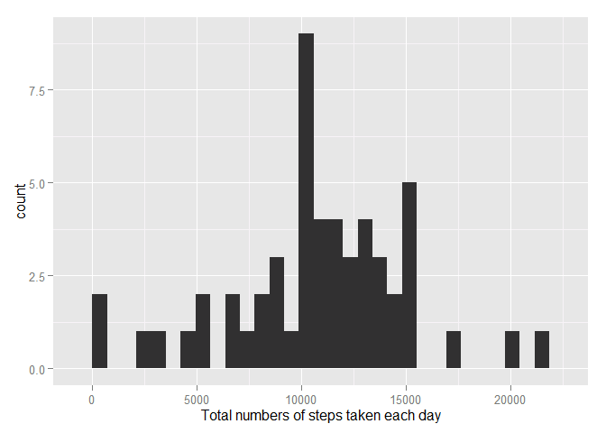
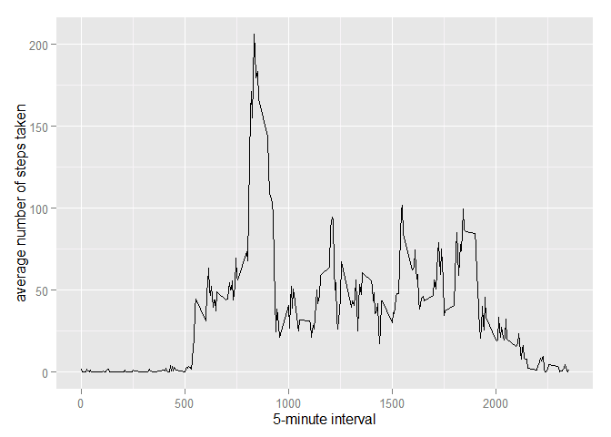
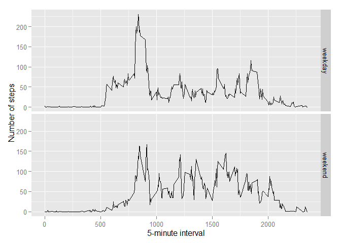

# Reproducible Research: Peer Assessment 1


## Loading and preprocessing the data

```r
unzip(zipfile="activity.zip")
Activity <- read.csv("activity.csv")
```

## What is mean total number of steps taken per day?

First the total number of steps taken per day is calculted across all dates and plotted. The first few rows of results are displayed.

```r
Totalstpperdate <- aggregate(steps ~ date, Activity, sum)
head(Totalstpperdate)
```

```
##         date steps
## 1 2012-10-02   126
## 2 2012-10-03 11352
## 3 2012-10-04 12116
## 4 2012-10-05 13294
## 5 2012-10-06 15420
## 6 2012-10-07 11015
```

The total number of steps is plotted as a histogram per frequency.

```r
library(ggplot2)
```

```
## Warning: package 'ggplot2' was built under R version 3.1.3
```

```r
qplot(Totalstpperdate$steps, binwindth = 1000, xlab = "Total numbers of steps taken each day")
```

```
## stat_bin: binwidth defaulted to range/30. Use 'binwidth = x' to adjust this.
```

 

The mean and median values of these total numbers are calculted.

```r
summary(Totalstpperdate$steps)
```

```
##    Min. 1st Qu.  Median    Mean 3rd Qu.    Max. 
##      41    8841   10760   10770   13290   21190
```
The mean of total number of steps taken per day is 10770 and the median is 10760. They are very close to each other.

## What is the average daily activity pattern?

The average number of steps taken per each 5 minutes interval is calculated. The first few rows of results are displayed.

```r
averagestpperinterval <- aggregate(x=Activity$steps, by = list(interval = Activity$interval), mean, na.rm=TRUE)
colnames(averagestpperinterval) = c("interval", "steps")
head(averagestpperinterval)
```

```
##   interval     steps
## 1        0 1.7169811
## 2        5 0.3396226
## 3       10 0.1320755
## 4       15 0.1509434
## 5       20 0.0754717
## 6       25 2.0943396
```

The plot for the average number of steps per interval is:

```r
ggplot(data=averagestpperinterval, aes(x=interval, y=steps)) +
    geom_line() +
    xlab("5-minute interval") +
    ylab("average number of steps taken")
```

 

Across all dates, the 5-minute interval contas the maximum number of steps is the 835th interval with 206.1698 steps.

```r
averagestpperinterval[which.max(averagestpperinterval$steps),]
```

```
##     interval    steps
## 104      835 206.1698
```
## Imputing missing values
Calculate and report the total number of missing values in the dataset

```r
missing <- is.na(Activity$steps)
# How many missing
table(missing)
```

```
## missing
## FALSE  TRUE 
## 15264  2304
```
2304 intervals are missing values of steps.
All the missing values will be filled with mean value for all respective 5-minute intervals.
The first few rows of mean values of steps for all respective intervals are showed as:

```r
head(averagestpperinterval)
```

```
##   interval     steps
## 1        0 1.7169811
## 2        5 0.3396226
## 3       10 0.1320755
## 4       15 0.1509434
## 5       20 0.0754717
## 6       25 2.0943396
```
The filling will be conducted as followed:

```r
fill.value <- function(steps, interval) {
    filled <- NA
    if (!is.na(steps))
        filled <- c(steps)
    else
        filled <- (averagestpperinterval[averagestpperinterval$interval==interval, "steps"])
    return(filled)
}
filleddata <- Activity
filleddata$steps <- mapply(fill.value, filleddata$steps, filleddata$interval)
```
With the new data, the total number of steps taken per day is calculated and plotted. The results are shown with first few rows.

```r
Totalstpperdatefilled <- aggregate(steps ~ date, filleddata, sum)
head(Totalstpperdatefilled)
```

```
##         date    steps
## 1 2012-10-01 10766.19
## 2 2012-10-02   126.00
## 3 2012-10-03 11352.00
## 4 2012-10-04 12116.00
## 5 2012-10-05 13294.00
## 6 2012-10-06 15420.00
```

The histogram of the total number of steps taken per day for the filled dataset is plotted.


```r
library(ggplot2)
qplot(Totalstpperdatefilled$steps, binwindth = 1000, xlab = "Total numbers of steps taken each day")
```

```
## stat_bin: binwidth defaulted to range/30. Use 'binwidth = x' to adjust this.
```

 

The mean and median values of these total numbers are calculted.

```r
summary(Totalstpperdatefilled$steps)
```

```
##    Min. 1st Qu.  Median    Mean 3rd Qu.    Max. 
##      41    9819   10770   10770   12810   21190
```
The mean and median are the same now due to adding the missing values for some intervals. The mean went higher but the median stayed the same comparing the filled dataset with the original dataset.

## Are there differences in activity patterns between weekdays and weekends?
First we determine whether it is a weekday or not for all intervals. The result of first few rows are shown.

```r
weekdayindicator <- function(date){
  day <- weekdays(date)
    if (day %in% c("Monday", "Tuesday", "Wednesday", "Thursday", "Friday"))
        return("weekday")
    else if (day %in% c("Saturday", "Sunday"))
        return("weekend")
    else
        stop("invalid date")
}
filleddata$date <- as.Date(filleddata$date)
filleddata$weekdayind <- sapply(filleddata$date, FUN=weekdayindicator)
head(filleddata)
```

```
##       steps       date interval weekdayind
## 1 1.7169811 2012-10-01        0    weekday
## 2 0.3396226 2012-10-01        5    weekday
## 3 0.1320755 2012-10-01       10    weekday
## 4 0.1509434 2012-10-01       15    weekday
## 5 0.0754717 2012-10-01       20    weekday
## 6 2.0943396 2012-10-01       25    weekday
```
The mean total numer of steps taken per interval are calculated and plotted respectively for weekdays and weekends.

```r
averagestpperintervalweekdayind <- aggregate(steps ~ interval + weekdayind, data=filleddata, mean)
ggplot(averagestpperintervalweekdayind, aes(interval, steps)) + geom_line() + facet_grid(weekdayind ~ .) +
    xlab("5-minute interval") + ylab("Number of steps")
```

 

There are obvious differences between patterns from weekdays and weekends. On weekdays, the 750th to 1000th intervals have slightly higher numbers of steps while on weekends, the 1000th to 1750th intervals seem to have higher number of steps. 
